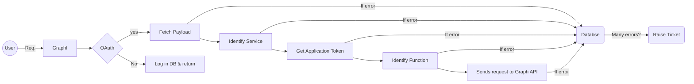

# GraphI - A graph API reusable component

This application is a versatile solution designed to interact with Microsoft Graph APIs, offering a wide range of functionalities from a single endpoint. It streamlines the process of integrating various Microsoft services into applications by providing a unified interface for authentication, request handling, and error management.

## Table of Contents

- [Introduction](#introduction)
- [Features](#features)
- [Project Structure](#project-structure)
- [Usage](#usage)
- [Dependencies](#dependencies)
- [Installation](#installation)
- [Configuration](#configuration)
- [Requirements](#requirements)
- [Error Handling](#error-handling)
- [Flow](#flow)

## Introduction

ABI applications often require integration with Microsoft services such as Outlook, Teams, and Calendar. However, registering apps individually, managing API requests, authentication, and error handling for each service can be costly, cumbersome, and time-consuming. This project aims to simplify this process by providing a reusable component that abstracts away the complexities of interacting with Microsoft Graph APIs.

## Features

- **Unified Endpoint**: Access various Microsoft services through a single API endpoint (/graphi), reducing endpoint clutter and simplifying integration.
- **Authentication**: Verify user credentials against Active Directory using JWT decode to ensure secure access to the API services.
- **Dynamic Routing**: Dynamically route requests to the appropriate service and function based on the payload, enhancing flexibility and scalability.
- **Error Logging**: Log API request details and errors to a database for troubleshooting and monitoring purposes.
- **Automated Ticketing**: Raise tickets for recurring errors, alerting developers to potential issues for prompt resolution.
- **Customizable Configuration**: Easily configure API URLs, authentication tokens, and other settings via environment variables.

## Project Structure

The project follows a modular structure to facilitate easy maintenance and scalability:

- **Root Directory**

  - `app.py`: Entry point of the application. Handles incoming requests, user authentication, payload extraction, and routing.
  - `.env`: Environment configuration file containing sensitive data such as API credentials and database details.
  - `database/`: Directory containing database configuration files.
  - `logger/`: Directory containing logger configuration files.

- **Services**

  - Service-specific folders for various Microsoft services:
    - `userProfile/`
    - `outlookMail/`
    - `outlookCalendar/`
    - `teams/`
  - Each service folder contains:
    - `{service}.py`: Handles service-specific logic and routing.
    - Subfolders `getReq/` and `postReq/` for handling GET and POST requests, respectively.
    - Function-specific files for different actions within the service.

- **Utils**
  - Utility files for common functionalities:
    - `apiConfig.py`: Configuration for Graph API URLs.
    - `authAD.py`: Authentication of user against Active Directory.
    - `getToken.py`: Generates application access tokens.
    - `raiseTicket.py`: Automated ticketing for error handling.

## Usage

1. Send a request to the `/graphi` endpoint with the payload in the request body and the Microsoft Access Token in the Bearer header.
2. The application authenticates the user against Active Directory using JWT decode.
3. Based on the identified service in the payload, the request is routed to the respective service folder.
4. The service-specific Python file determines the requested function within the service.
5. Depending on the function, the request is further routed to the appropriate subfolder (`getReq` or `postReq`).
6. The function file calls the Graph API to perform the required action.
7. Request details and errors are logged to the database for monitoring and troubleshooting purposes.

## Dependencies

- Python 3.x
- Flask
- Microsoft Graph API

## Installation

1. Clone the repository
2. Navigate to the project directory
3. Set up a virtual environment
4. Activate the virtual environment:
5. Install dependencies: `pip install -r requirements.txt`
6. Configure environment variables in `.env` file.
7. Run the Flask application: `python app.py`

## Configuration

- Update the `.env` file with the necessary configuration settings:
  - `CLIENT_ID`: Microsoft Azure AD Application Client ID.
  - `CLIENT_SECRET`: Microsoft Azure AD Application Client Secret.
  - Other environment-specific configurations (database settings, logger configurations, etc.).

## Requirements

| Package    | Version |
| ---------- | ------- |
| flask      | Latest  |
| flask_cors | Latest  |
| jwt        | Latest  |
| requests   | Latest  |
| sqlalchemy | Latest  |

## Error Handling

The application employs robust error handling mechanisms:

- Detailed error messages are returned to the client for easy debugging.
- Errors are logged to the database for monitoring and analysis.
- Automated ticketing system alerts developers to recurring errors for prompt resolution.

## Flow

